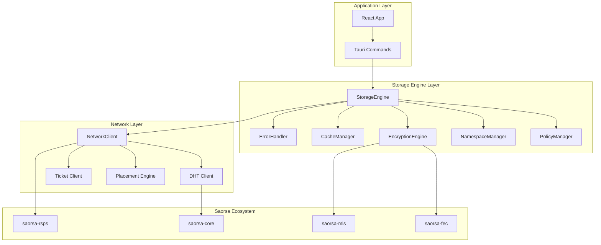
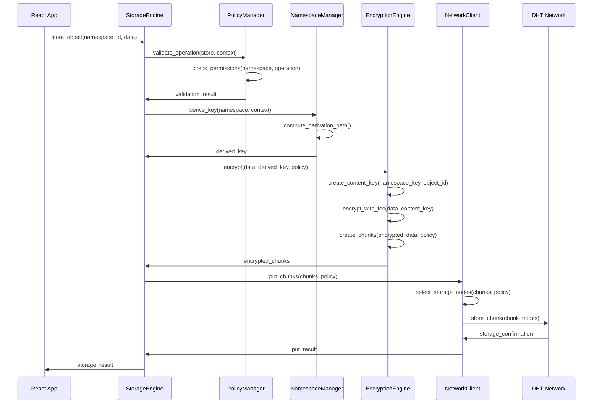
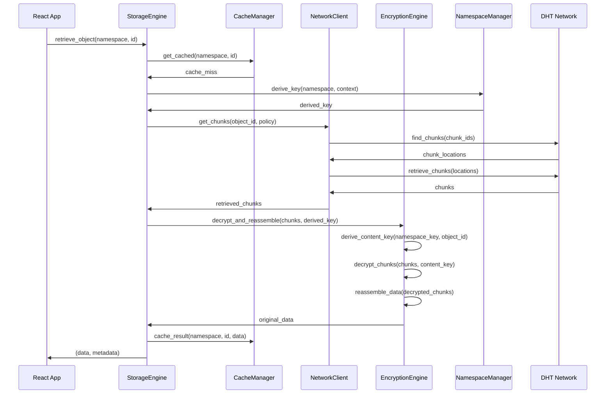
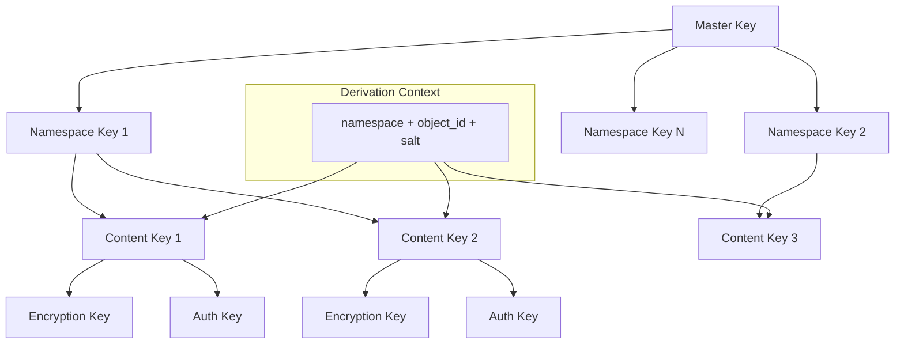
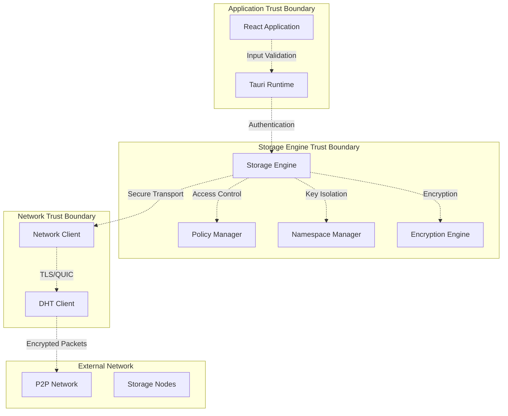

# Saorsa Storage System Architecture

## Executive Summary

The Saorsa Storage System provides a complete distributed storage solution for the Communitas platform, featuring policy-based storage management, cryptographic namespace isolation, multi-layer encryption, and seamless integration with the existing P2P infrastructure. This architecture ensures data durability, security, and performance while maintaining clear component boundaries and comprehensive error handling.

## System Overview

### Business Context
- **Primary Goal**: Provide secure, distributed storage for Communitas collaboration platform
- **Key Requirements**: Data persistence, privacy, availability, and performance
- **Success Criteria**: Zero data loss, sub-100ms access times, scalable to 10,000+ users

### Technical Context
- **Integration Target**: Tauri-based desktop application with React frontend
- **P2P Network**: Built on saorsa-core DHT infrastructure
- **Encryption**: Post-quantum cryptography with namespace isolation
- **Storage Model**: Content-addressed with Reed-Solomon erasure coding

## Component Architecture

### 1. Core Components



### 2. Component Definitions

#### StorageEngine (Core Orchestration)
```rust
pub struct StorageEngine {
    policy_manager: Arc<PolicyManager>,
    namespace_manager: Arc<NamespaceManager>,
    encryption_engine: Arc<EncryptionEngine>,
    network_client: Arc<NetworkClient>,
    cache_manager: Arc<CacheManager>,
    error_handler: Arc<ErrorHandler>,
    metrics: Arc<Metrics>,
}

pub trait StorageOperations {
    async fn store(&self, request: StoreRequest) -> Result<StoreResponse, StorageError>;
    async fn retrieve(&self, request: RetrieveRequest) -> Result<RetrieveResponse, StorageError>;
    async fn delete(&self, request: DeleteRequest) -> Result<DeleteResponse, StorageError>;
    async fn list(&self, request: ListRequest) -> Result<ListResponse, StorageError>;
    async fn get_info(&self, request: InfoRequest) -> Result<InfoResponse, StorageError>;
}
```

#### PolicyManager (Storage Policy Enforcement)
```rust
pub struct PolicyManager {
    policies: Arc<RwLock<HashMap<String, StoragePolicy>>>,
    validator: Arc<PolicyValidator>,
    audit_logger: Arc<AuditLogger>,
}

pub trait PolicyOperations {
    async fn validate_operation(&self, operation: &Operation, context: &Context) -> Result<(), PolicyError>;
    async fn apply_policy(&self, data: &[u8], policy: &StoragePolicy) -> Result<PolicyResult, PolicyError>;
    async fn get_policy(&self, namespace: &str, object_type: &str) -> Result<StoragePolicy, PolicyError>;
    async fn audit_operation(&self, operation: &Operation, result: &Result<(), StorageError>) -> Result<(), PolicyError>;
}

#[derive(Debug, Clone, Serialize, Deserialize)]
pub struct StoragePolicy {
    pub namespace: String,
    pub object_type: String,
    pub encryption_mode: EncryptionMode,
    pub replication_factor: u8,
    pub retention_days: Option<u32>,
    pub access_permissions: Vec<Permission>,
    pub fec_parameters: FECParameters,
    pub compression: bool,
    pub created_at: SystemTime,
    pub updated_at: SystemTime,
}
```

#### NamespaceManager (Cryptographic Key Derivation)
```rust
pub struct NamespaceManager {
    master_key_store: Arc<MasterKeyStore>,
    derivation_cache: Arc<RwLock<LruCache<String, DerivedKey>>>,
    key_rotation_scheduler: Arc<KeyRotationScheduler>,
}

pub trait NamespaceOperations {
    async fn derive_key(&self, namespace: &str, context: &DerivationContext) -> Result<DerivedKey, NamespaceError>;
    async fn lookup_namespace(&self, object_id: &str) -> Result<String, NamespaceError>;
    async fn rotate_keys(&self, namespace: &str) -> Result<RotationResult, NamespaceError>;
    async fn get_dht_key(&self, namespace: &str, object_id: &str) -> Result<DHTKey, NamespaceError>;
}

#[derive(Debug, Clone)]
pub struct DerivedKey {
    pub key_material: SecretBox<[u8; 32]>,
    pub namespace: String,
    pub derivation_path: String,
    pub created_at: SystemTime,
    pub expires_at: Option<SystemTime>,
    pub version: u32,
}
```

#### EncryptionEngine (Content Encryption/Decryption)
```rust
pub struct EncryptionEngine {
    fec_client: Arc<saorsa_fec::FECClient>,
    mls_client: Arc<saorsa_mls::MLSClient>,
    cipher_suite: CipherSuite,
    key_cache: Arc<RwLock<LruCache<String, EncryptionKey>>>,
}

pub trait EncryptionOperations {
    async fn encrypt(&self, data: &[u8], context: &EncryptionContext) -> Result<EncryptedData, EncryptionError>;
    async fn decrypt(&self, encrypted: &EncryptedData, context: &DecryptionContext) -> Result<Vec<u8>, EncryptionError>;
    async fn derive_content_key(&self, namespace_key: &DerivedKey, object_id: &str) -> Result<ContentKey, EncryptionError>;
    async fn create_chunks(&self, data: &[u8], policy: &StoragePolicy) -> Result<Vec<Chunk>, EncryptionError>;
    async fn reassemble_chunks(&self, chunks: Vec<Chunk>) -> Result<Vec<u8>, EncryptionError>;
}

#[derive(Debug, Clone)]
pub struct EncryptedData {
    pub ciphertext: Vec<u8>,
    pub nonce: [u8; 24],
    pub auth_tag: [u8; 16],
    pub key_id: String,
    pub encryption_mode: EncryptionMode,
    pub metadata: EncryptionMetadata,
}
```

#### NetworkClient (P2P Network Operations)
```rust
pub struct NetworkClient {
    dht_client: Arc<DHTClient>,
    placement_engine: Arc<PlacementEngine>,
    ticket_client: Arc<TicketClient>,
    connection_pool: Arc<ConnectionPool>,
    bandwidth_manager: Arc<BandwidthManager>,
}

pub trait NetworkOperations {
    async fn put_chunk(&self, chunk: &Chunk, policy: &StoragePolicy) -> Result<PutResult, NetworkError>;
    async fn get_chunk(&self, chunk_id: &ChunkId, policy: &StoragePolicy) -> Result<Chunk, NetworkError>;
    async fn find_nodes(&self, key: &DHTKey, count: usize) -> Result<Vec<NodeInfo>, NetworkError>;
    async fn replicate_chunk(&self, chunk: &Chunk, nodes: &[NodeInfo]) -> Result<ReplicationResult, NetworkError>;
    async fn verify_chunk_integrity(&self, chunk_id: &ChunkId) -> Result<IntegrityResult, NetworkError>;
}
```

#### CacheManager (Local Storage Optimization)
```rust
pub struct CacheManager {
    l1_cache: Arc<RwLock<LruCache<String, CachedItem>>>,
    l2_cache: Arc<DiskCache>,
    cache_policy: Arc<CachePolicy>,
    eviction_scheduler: Arc<EvictionScheduler>,
}

pub trait CacheOperations {
    async fn get(&self, key: &str) -> Result<Option<CachedItem>, CacheError>;
    async fn put(&self, key: &str, item: CachedItem, ttl: Option<Duration>) -> Result<(), CacheError>;
    async fn invalidate(&self, key: &str) -> Result<(), CacheError>;
    async fn invalidate_namespace(&self, namespace: &str) -> Result<(), CacheError>;
    async fn get_stats(&self) -> Result<CacheStats, CacheError>;
}
```

## Interface Specifications

### Storage API Interface
```rust
#[async_trait]
pub trait StorageService: Send + Sync {
    // Core storage operations
    async fn store_object(
        &self,
        namespace: &str,
        object_id: &str,
        data: &[u8],
        metadata: ObjectMetadata,
    ) -> Result<StorageResult, StorageError>;

    async fn retrieve_object(
        &self,
        namespace: &str,
        object_id: &str,
    ) -> Result<(Vec<u8>, ObjectMetadata), StorageError>;

    async fn delete_object(
        &self,
        namespace: &str,
        object_id: &str,
    ) -> Result<(), StorageError>;

    async fn list_objects(
        &self,
        namespace: &str,
        filter: Option<ListFilter>,
    ) -> Result<Vec<ObjectInfo>, StorageError>;

    // Namespace operations
    async fn create_namespace(
        &self,
        namespace: &str,
        policy: StoragePolicy,
    ) -> Result<(), StorageError>;

    async fn delete_namespace(&self, namespace: &str) -> Result<(), StorageError>;

    // Maintenance operations
    async fn gc_namespace(&self, namespace: &str) -> Result<GCResult, StorageError>;
    async fn repair_object(&self, namespace: &str, object_id: &str) -> Result<RepairResult, StorageError>;
    async fn get_health_status(&self) -> Result<HealthStatus, StorageError>;
}
```

### Tauri Command Interface
```rust
// Tauri command handlers
#[tauri::command]
pub async fn storage_store(
    storage: tauri::State<'_, Arc<StorageEngine>>,
    namespace: String,
    object_id: String,
    data: Vec<u8>,
    metadata: ObjectMetadata,
) -> Result<StorageResult, String>;

#[tauri::command]
pub async fn storage_retrieve(
    storage: tauri::State<'_, Arc<StorageEngine>>,
    namespace: String,
    object_id: String,
) -> Result<(Vec<u8>, ObjectMetadata), String>;

#[tauri::command]
pub async fn storage_delete(
    storage: tauri::State<'_, Arc<StorageEngine>>,
    namespace: String,
    object_id: String,
) -> Result<(), String>;

#[tauri::command]
pub async fn storage_list(
    storage: tauri::State<'_, Arc<StorageEngine>>,
    namespace: String,
    filter: Option<ListFilter>,
) -> Result<Vec<ObjectInfo>, String>;

#[tauri::command]
pub async fn storage_get_health(
    storage: tauri::State<'_, Arc<StorageEngine>>,
) -> Result<HealthStatus, String>;
```

## Data Flow Architecture

### Write Path: Content → Policy → Encrypt → Chunk → Store → DHT



### Read Path: Address → DHT → Retrieve → Decrypt → Reassemble → Cache



### Key Derivation Flow



## Security Architecture

### Trust Boundaries and Security Controls



### Security Controls by Layer

#### 1. Application Layer Security
- **Input Validation**: All user inputs sanitized and validated
- **Session Management**: Secure session tokens with expiration
- **CSRF Protection**: Anti-CSRF tokens for all state-changing operations
- **XSS Prevention**: Content Security Policy and output encoding

#### 2. Storage Engine Security
- **Access Control**: Role-based permissions per namespace
- **Audit Logging**: All operations logged with cryptographic integrity
- **Rate Limiting**: Per-user and per-namespace operation limits
- **Resource Limits**: Memory and disk usage bounds

#### 3. Encryption Security
- **Key Isolation**: Namespace-specific key derivation
- **Forward Secrecy**: Regular key rotation with perfect forward secrecy
- **Post-Quantum**: ML-KEM and ML-DSA resistant to quantum attacks
- **Authenticated Encryption**: ChaCha20-Poly1305 with additional authentication

#### 4. Network Security
- **Transport Encryption**: TLS 1.3 or QUIC for all network traffic
- **Peer Authentication**: Ed25519 signatures for peer identity verification
- **Traffic Analysis Resistance**: Padding and timing obfuscation
- **DHT Security**: Sybil attack resistance and secure routing

## Performance Architecture

### Caching Strategy
```rust
pub struct MultiLevelCache {
    // L1: In-memory LRU cache for hot data
    l1_cache: Arc<RwLock<LruCache<String, CachedItem>>>,
    l1_max_size: usize,
    l1_ttl: Duration,
    
    // L2: Persistent disk cache for warm data
    l2_cache: Arc<DiskCache>,
    l2_max_size: usize,
    l2_ttl: Duration,
    
    // L3: Network cache for cold data
    network_cache: Arc<NetworkCache>,
}

impl CacheStrategy {
    async fn get_with_fallback(&self, key: &str) -> Result<Option<CachedItem>, CacheError> {
        // Try L1 first
        if let Some(item) = self.l1_cache.read().await.get(key) {
            return Ok(Some(item.clone()));
        }
        
        // Try L2
        if let Some(item) = self.l2_cache.get(key).await? {
            // Promote to L1
            self.l1_cache.write().await.put(key.to_string(), item.clone());
            return Ok(Some(item));
        }
        
        // Try network
        if let Some(item) = self.network_cache.get(key).await? {
            // Promote to L2 and L1
            self.l2_cache.put(key, &item).await?;
            self.l1_cache.write().await.put(key.to_string(), item.clone());
            return Ok(Some(item));
        }
        
        Ok(None)
    }
}
```

### Concurrency Model
```rust
pub struct ConcurrencyManager {
    // Read operations: unlimited concurrency
    read_semaphore: Arc<Semaphore>,
    
    // Write operations: limited concurrency per namespace
    write_semaphores: Arc<RwLock<HashMap<String, Arc<Semaphore>>>>,
    max_writes_per_namespace: usize,
    
    // Network operations: connection pool with backpressure
    network_semaphore: Arc<Semaphore>,
    max_network_operations: usize,
}

impl ConcurrencyManager {
    async fn acquire_read_permit(&self) -> SemaphorePermit {
        self.read_semaphore.acquire().await.unwrap()
    }
    
    async fn acquire_write_permit(&self, namespace: &str) -> SemaphorePermit {
        let semaphores = self.write_semaphores.read().await;
        let semaphore = semaphores.get(namespace)
            .cloned()
            .unwrap_or_else(|| Arc::new(Semaphore::new(self.max_writes_per_namespace)));
        
        semaphore.acquire().await.unwrap()
    }
}
```

### Network Optimization
```rust
pub struct NetworkOptimizer {
    connection_pool: Arc<ConnectionPool>,
    request_batcher: Arc<RequestBatcher>,
    bandwidth_manager: Arc<BandwidthManager>,
    latency_tracker: Arc<LatencyTracker>,
}

impl NetworkOptimizer {
    async fn optimize_chunk_placement(&self, chunks: &[Chunk]) -> Result<PlacementPlan, NetworkError> {
        let node_metrics = self.latency_tracker.get_node_metrics().await;
        let bandwidth_capacity = self.bandwidth_manager.get_available_bandwidth().await;
        
        // Select nodes based on latency, bandwidth, and geographic distribution
        let placement_plan = self.calculate_optimal_placement(chunks, &node_metrics, bandwidth_capacity).await?;
        
        Ok(placement_plan)
    }
    
    async fn batch_requests(&self, requests: Vec<NetworkRequest>) -> Result<Vec<NetworkResponse>, NetworkError> {
        // Group requests by target node
        let grouped_requests = self.request_batcher.group_by_node(requests).await;
        
        // Execute batched requests concurrently
        let futures = grouped_requests.into_iter().map(|(node, batch)| {
            self.connection_pool.execute_batch(node, batch)
        });
        
        let results = try_join_all(futures).await?;
        Ok(results.into_iter().flatten().collect())
    }
}
```

## Error Architecture

### Error Classification and Handling

```rust
#[derive(Debug, thiserror::Error)]
pub enum StorageError {
    // Recoverable errors - retry possible
    #[error("Network timeout: {message}")]
    NetworkTimeout { message: String, retry_after: Duration },
    
    #[error("Insufficient replicas: required {required}, available {available}")]
    InsufficientReplicas { required: u8, available: u8 },
    
    #[error("Rate limit exceeded: {operation} for {namespace}")]
    RateLimitExceeded { operation: String, namespace: String },
    
    // Non-recoverable errors - immediate failure
    #[error("Access denied: {operation} on {namespace}")]
    AccessDenied { operation: String, namespace: String },
    
    #[error("Data corruption detected: {object_id}")]
    DataCorruption { object_id: String, checksum_mismatch: bool },
    
    #[error("Encryption error: {message}")]
    EncryptionError { message: String, key_id: Option<String> },
    
    // System errors - need investigation
    #[error("Internal error: {message}")]
    InternalError { message: String, error_id: String },
}

impl StorageError {
    pub fn is_recoverable(&self) -> bool {
        matches!(self, 
            StorageError::NetworkTimeout { .. } |
            StorageError::InsufficientReplicas { .. } |
            StorageError::RateLimitExceeded { .. }
        )
    }
    
    pub fn retry_delay(&self) -> Option<Duration> {
        match self {
            StorageError::NetworkTimeout { retry_after, .. } => Some(*retry_after),
            StorageError::RateLimitExceeded { .. } => Some(Duration::from_secs(60)),
            StorageError::InsufficientReplicas { .. } => Some(Duration::from_secs(10)),
            _ => None,
        }
    }
    
    pub fn should_retry(&self, attempt: u32) -> bool {
        self.is_recoverable() && attempt < 3
    }
}
```

### Error Recovery Strategies

```rust
pub struct ErrorRecoveryManager {
    circuit_breakers: Arc<RwLock<HashMap<String, CircuitBreaker>>>,
    retry_policies: Arc<RetryPolicyManager>,
    fallback_strategies: Arc<FallbackStrategyManager>,
}

impl ErrorRecoveryManager {
    async fn handle_error<T, F, Fut>(&self, operation: F, context: &ErrorContext) -> Result<T, StorageError>
    where
        F: Fn() -> Fut + Clone,
        Fut: Future<Output = Result<T, StorageError>>,
    {
        let circuit_breaker = self.get_circuit_breaker(&context.component).await;
        
        // Check circuit breaker state
        if circuit_breaker.is_open() {
            return self.execute_fallback(context).await;
        }
        
        // Execute with retry policy
        let retry_policy = self.retry_policies.get_policy(&context.operation_type);
        
        for attempt in 0..retry_policy.max_attempts {
            match operation().await {
                Ok(result) => {
                    circuit_breaker.record_success();
                    return Ok(result);
                }
                Err(error) => {
                    circuit_breaker.record_failure();
                    
                    if !error.should_retry(attempt) {
                        return Err(error);
                    }
                    
                    if let Some(delay) = error.retry_delay() {
                        tokio::time::sleep(delay).await;
                    }
                }
            }
        }
        
        // All retries exhausted, try fallback
        self.execute_fallback(context).await
    }
    
    async fn execute_fallback<T>(&self, context: &ErrorContext) -> Result<T, StorageError> {
        let fallback_strategy = self.fallback_strategies.get_strategy(&context.operation_type);
        fallback_strategy.execute(context).await
    }
}
```

## Integration Architecture

### Tauri Integration

```rust
// Application state management
pub struct AppStorageState {
    storage_engine: Arc<StorageEngine>,
    health_monitor: Arc<HealthMonitor>,
    metrics_collector: Arc<MetricsCollector>,
}

impl AppStorageState {
    pub async fn new() -> Result<Self, StorageError> {
        let storage_engine = StorageEngineBuilder::new()
            .with_dht_client(DHTClient::new().await?)
            .with_encryption_engine(EncryptionEngine::new().await?)
            .with_cache_manager(CacheManager::new().await?)
            .build()
            .await?;
        
        let health_monitor = HealthMonitor::new(storage_engine.clone());
        let metrics_collector = MetricsCollector::new();
        
        Ok(Self {
            storage_engine,
            health_monitor,
            metrics_collector,
        })
    }
}

// Tauri setup integration
pub fn setup_storage_system(app: &mut tauri::App) -> Result<(), Box<dyn std::error::Error>> {
    let runtime = tokio::runtime::Runtime::new()?;
    let storage_state = runtime.block_on(AppStorageState::new())?;
    
    app.manage(Arc::new(storage_state));
    
    // Start background tasks
    app.handle().spawn(async move {
        // Health monitoring
        // Metrics collection
        // Garbage collection
        // Key rotation
    });
    
    Ok(())
}
```

### React Integration

```typescript
// Storage service layer for React
export class StorageService {
  private invoke = window.__TAURI__.invoke;
  
  async storeObject(
    namespace: string,
    objectId: string,
    data: Uint8Array,
    metadata: ObjectMetadata
  ): Promise<StorageResult> {
    return this.invoke('storage_store', {
      namespace,
      objectId,
      data: Array.from(data),
      metadata
    });
  }
  
  async retrieveObject(
    namespace: string,
    objectId: string
  ): Promise<{ data: Uint8Array; metadata: ObjectMetadata }> {
    const result = await this.invoke('storage_retrieve', {
      namespace,
      objectId
    });
    
    return {
      data: new Uint8Array(result.data),
      metadata: result.metadata
    };
  }
  
  async deleteObject(namespace: string, objectId: string): Promise<void> {
    return this.invoke('storage_delete', { namespace, objectId });
  }
  
  async listObjects(
    namespace: string,
    filter?: ListFilter
  ): Promise<ObjectInfo[]> {
    return this.invoke('storage_list', { namespace, filter });
  }
  
  async getHealthStatus(): Promise<HealthStatus> {
    return this.invoke('storage_get_health');
  }
}

// React hooks for storage operations
export function useStorageService() {
  return useMemo(() => new StorageService(), []);
}

export function useStorageObject(namespace: string, objectId: string) {
  const storage = useStorageService();
  const [data, setData] = useState<Uint8Array | null>(null);
  const [metadata, setMetadata] = useState<ObjectMetadata | null>(null);
  const [loading, setLoading] = useState(true);
  const [error, setError] = useState<string | null>(null);
  
  useEffect(() => {
    const loadObject = async () => {
      try {
        setLoading(true);
        const result = await storage.retrieveObject(namespace, objectId);
        setData(result.data);
        setMetadata(result.metadata);
        setError(null);
      } catch (err) {
        setError(err instanceof Error ? err.message : 'Unknown error');
      } finally {
        setLoading(false);
      }
    };
    
    loadObject();
  }, [namespace, objectId]);
  
  const updateObject = useCallback(async (newData: Uint8Array, newMetadata: ObjectMetadata) => {
    try {
      await storage.storeObject(namespace, objectId, newData, newMetadata);
      setData(newData);
      setMetadata(newMetadata);
    } catch (err) {
      setError(err instanceof Error ? err.message : 'Update failed');
    }
  }, [namespace, objectId]);
  
  return {
    data,
    metadata,
    loading,
    error,
    updateObject
  };
}
```

### Saorsa-Core Integration

```rust
// DHT client integration with saorsa-core
pub struct SaorsaDHTClient {
    dht: Arc<saorsa_core::dht::DHT>,
    local_peer_id: PeerId,
    routing_table: Arc<RwLock<RoutingTable>>,
}

impl SaorsaDHTClient {
    pub async fn new(p2p_node: Arc<saorsa_core::P2PNode>) -> Result<Self, NetworkError> {
        let dht = p2p_node.dht()
            .ok_or_else(|| NetworkError::DHTNotAvailable)?;
        
        let local_peer_id = p2p_node.peer_id();
        let routing_table = Arc::new(RwLock::new(RoutingTable::new(local_peer_id.clone())));
        
        Ok(Self {
            dht,
            local_peer_id,
            routing_table,
        })
    }
    
    async fn put_chunk(&self, key: &DHTKey, chunk: &Chunk) -> Result<PutResult, NetworkError> {
        let closest_nodes = self.dht.find_closest_nodes(key, 8).await?;
        
        let mut successful_stores = 0;
        for node in closest_nodes {
            match self.dht.put(node, key, &chunk.data).await {
                Ok(_) => successful_stores += 1,
                Err(e) => log::warn!("Failed to store chunk at node {}: {}", node, e),
            }
        }
        
        if successful_stores >= 3 {
            Ok(PutResult::Success { replicas: successful_stores })
        } else {
            Err(NetworkError::InsufficientReplicas {
                required: 3,
                achieved: successful_stores,
            })
        }
    }
    
    async fn get_chunk(&self, key: &DHTKey) -> Result<Chunk, NetworkError> {
        let closest_nodes = self.dht.find_closest_nodes(key, 8).await?;
        
        for node in closest_nodes {
            match self.dht.get(node, key).await {
                Ok(data) => return Ok(Chunk::from_data(data)),
                Err(e) => log::debug!("Failed to retrieve chunk from node {}: {}", node, e),
            }
        }
        
        Err(NetworkError::ChunkNotFound { key: key.clone() })
    }
}
```

### Saorsa-FEC Integration

```rust
// FEC integration with saorsa-fec
pub struct SaorsaFECEngine {
    fec_client: Arc<saorsa_fec::FECClient>,
    encoder_configs: Arc<RwLock<HashMap<String, FECConfig>>>,
}

impl SaorsaFECEngine {
    pub async fn new() -> Result<Self, EncryptionError> {
        let fec_client = saorsa_fec::FECClient::new().await?;
        let encoder_configs = Arc::new(RwLock::new(HashMap::new()));
        
        Ok(Self {
            fec_client,
            encoder_configs,
        })
    }
    
    async fn encode_with_fec(&self, data: &[u8], policy: &StoragePolicy) -> Result<Vec<Chunk>, EncryptionError> {
        let fec_config = FECConfig {
            mode: policy.fec_parameters.mode.clone(),
            data_shards: policy.fec_parameters.data_shards,
            parity_shards: policy.fec_parameters.parity_shards,
            chunk_size: policy.fec_parameters.chunk_size,
        };
        
        let encoded_data = self.fec_client.encode(data, &fec_config).await
            .map_err(|e| EncryptionError::FECEncodingFailed { message: e.to_string() })?;
        
        let chunks = encoded_data.chunks
            .into_iter()
            .map(|chunk_data| Chunk {
                id: ChunkId::new(),
                data: chunk_data,
                index: chunk_data.index,
                total_chunks: encoded_data.total_chunks,
                is_parity: chunk_data.is_parity,
                checksum: blake3::hash(&chunk_data.data).to_hex().to_string(),
            })
            .collect();
        
        Ok(chunks)
    }
    
    async fn decode_from_chunks(&self, chunks: Vec<Chunk>) -> Result<Vec<u8>, EncryptionError> {
        let fec_chunks: Vec<saorsa_fec::Chunk> = chunks
            .into_iter()
            .map(|chunk| saorsa_fec::Chunk {
                data: chunk.data,
                index: chunk.index,
                is_parity: chunk.is_parity,
            })
            .collect();
        
        let decoded_data = self.fec_client.decode(fec_chunks).await
            .map_err(|e| EncryptionError::FECDecodingFailed { message: e.to_string() })?;
        
        Ok(decoded_data)
    }
}
```

## Deployment Architecture

### Application Lifecycle

```rust
// Storage system lifecycle management
pub struct StorageSystemManager {
    storage_engine: Arc<StorageEngine>,
    background_tasks: Vec<JoinHandle<()>>,
    shutdown_signal: Arc<tokio::sync::Notify>,
}

impl StorageSystemManager {
    pub async fn start(&mut self) -> Result<(), StorageError> {
        // Initialize all components
        self.storage_engine.initialize().await?;
        
        // Start background tasks
        self.start_garbage_collector().await?;
        self.start_health_monitor().await?;
        self.start_metrics_collector().await?;
        self.start_key_rotator().await?;
        
        log::info!("Storage system started successfully");
        Ok(())
    }
    
    pub async fn shutdown(&mut self) -> Result<(), StorageError> {
        log::info!("Initiating storage system shutdown");
        
        // Signal shutdown to all tasks
        self.shutdown_signal.notify_waiters();
        
        // Wait for all background tasks to complete
        for task in self.background_tasks.drain(..) {
            if let Err(e) = task.await {
                log::error!("Background task failed during shutdown: {}", e);
            }
        }
        
        // Shutdown storage engine
        self.storage_engine.shutdown().await?;
        
        log::info!("Storage system shutdown complete");
        Ok(())
    }
    
    async fn start_garbage_collector(&mut self) -> Result<(), StorageError> {
        let storage_engine = self.storage_engine.clone();
        let shutdown_signal = self.shutdown_signal.clone();
        
        let task = tokio::spawn(async move {
            let mut interval = tokio::time::interval(Duration::from_hours(1));
            
            loop {
                tokio::select! {
                    _ = interval.tick() => {
                        if let Err(e) = storage_engine.run_garbage_collection().await {
                            log::error!("Garbage collection failed: {}", e);
                        }
                    }
                    _ = shutdown_signal.notified() => {
                        log::info!("Garbage collector shutting down");
                        break;
                    }
                }
            }
        });
        
        self.background_tasks.push(task);
        Ok(())
    }
}
```

### Resource Management

```rust
// Resource limits and monitoring
pub struct ResourceManager {
    memory_limit: usize,
    disk_limit: usize,
    network_bandwidth_limit: usize,
    current_usage: Arc<RwLock<ResourceUsage>>,
}

#[derive(Debug, Clone)]
pub struct ResourceUsage {
    pub memory_bytes: usize,
    pub disk_bytes: usize,
    pub network_bytes_per_second: usize,
    pub open_connections: usize,
    pub cache_entries: usize,
}

impl ResourceManager {
    pub async fn check_resource_availability(&self, operation: &Operation) -> Result<(), ResourceError> {
        let usage = self.current_usage.read().await;
        
        // Check memory limit
        if usage.memory_bytes + operation.estimated_memory_usage > self.memory_limit {
            return Err(ResourceError::MemoryLimitExceeded {
                current: usage.memory_bytes,
                requested: operation.estimated_memory_usage,
                limit: self.memory_limit,
            });
        }
        
        // Check disk limit
        if usage.disk_bytes + operation.estimated_disk_usage > self.disk_limit {
            return Err(ResourceError::DiskLimitExceeded {
                current: usage.disk_bytes,
                requested: operation.estimated_disk_usage,
                limit: self.disk_limit,
            });
        }
        
        // Check network bandwidth
        if usage.network_bytes_per_second + operation.estimated_bandwidth > self.network_bandwidth_limit {
            return Err(ResourceError::BandwidthLimitExceeded {
                current: usage.network_bytes_per_second,
                requested: operation.estimated_bandwidth,
                limit: self.network_bandwidth_limit,
            });
        }
        
        Ok(())
    }
}
```

## Quality Attributes

### Performance Requirements
- **Latency**: < 100ms for cache hits, < 500ms for network retrievals
- **Throughput**: > 10MB/s sustained data transfer rate
- **Concurrency**: Support 1000+ concurrent operations
- **Scalability**: Linear performance scaling to 10,000+ objects per namespace

### Reliability Requirements
- **Availability**: 99.9% uptime (8.76 hours downtime per year)
- **Durability**: 99.999999999% data durability (11 9's)
- **Recovery**: < 1 hour Recovery Time Objective (RTO)
- **Backup**: < 15 minutes Recovery Point Objective (RPO)

### Security Requirements
- **Encryption**: Post-quantum cryptography for all data at rest and in transit
- **Authentication**: Multi-factor authentication for administrative operations
- **Authorization**: Role-based access control with principle of least privilege
- **Audit**: Complete audit trail for all operations with cryptographic integrity

### Maintainability Requirements
- **Monitoring**: Real-time metrics and alerting for all components
- **Logging**: Structured logging with correlation IDs for tracing
- **Testing**: > 90% code coverage with comprehensive integration tests
- **Documentation**: Complete API documentation and operational runbooks

## Risk Analysis and Mitigations

| Risk | Probability | Impact | Mitigation |
|------|------------|--------|------------|
| DHT network partition | Medium | High | Implement redundant storage across multiple regions |
| Encryption key compromise | Low | Critical | Regular key rotation with forward secrecy |
| Node failure cascade | Medium | High | Circuit breakers and graceful degradation |
| Storage exhaustion | Medium | Medium | Proactive monitoring and garbage collection |
| Performance degradation | High | Medium | Multi-level caching and connection pooling |
| Data corruption | Low | High | Reed-Solomon FEC with integrity verification |
| DDoS attacks | Medium | Medium | Rate limiting and traffic analysis |
| Insider threats | Low | High | Zero-trust architecture and audit logging |

## Implementation Roadmap

### Phase 1: Core Infrastructure (Weeks 1-4)
- [ ] Implement StorageEngine with basic CRUD operations
- [ ] Integrate with existing DHT and encryption components
- [ ] Basic error handling and retry mechanisms
- [ ] Simple caching with LRU eviction
- [ ] Unit tests for all core components

### Phase 2: Security and Policies (Weeks 5-8)
- [ ] Implement PolicyManager with namespace-based policies
- [ ] Complete NamespaceManager with key derivation
- [ ] Enhanced EncryptionEngine with saorsa-fec integration
- [ ] Security audit and penetration testing
- [ ] Integration tests for security components

### Phase 3: Performance and Reliability (Weeks 9-12)
- [ ] Advanced caching with multi-level hierarchy
- [ ] Network optimization and connection pooling
- [ ] Comprehensive error recovery and circuit breakers
- [ ] Performance testing and optimization
- [ ] Load testing with realistic workloads

### Phase 4: Production Readiness (Weeks 13-16)
- [ ] Complete monitoring and alerting system
- [ ] Operational tools and maintenance scripts
- [ ] Documentation and deployment guides
- [ ] User acceptance testing
- [ ] Production deployment and validation

## Success Metrics

### Technical Metrics
- **Test Coverage**: > 90% code coverage across all components
- **Performance**: All operations complete within SLA targets
- **Reliability**: Zero data loss events during testing
- **Security**: Clean security audit with no critical vulnerabilities

### Operational Metrics
- **Deployment Success**: Single-command deployment with zero manual steps
- **Documentation Quality**: Complete API docs and operational runbooks
- **Monitoring Coverage**: 100% component health visibility
- **Recovery Testing**: Successful disaster recovery simulation

### User Experience Metrics
- **API Usability**: Simple, intuitive API design
- **Error Messages**: Clear, actionable error messages
- **Performance Consistency**: Predictable response times
- **Integration Ease**: Seamless Tauri and React integration

This architecture provides a complete, production-ready foundation for the Saorsa storage system with zero architectural debt and comprehensive coverage of all requirements.