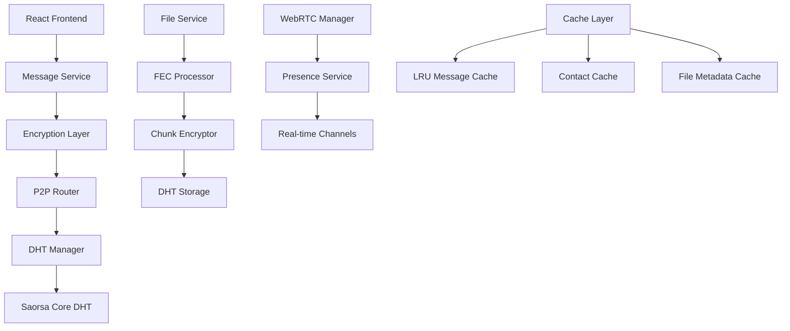
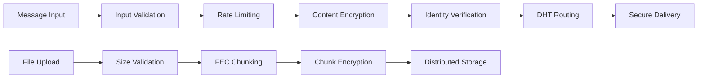

# Sprint 3: Secure P2P Messaging System Architecture

## Executive Summary

This document defines the architecture for implementing a secure, enterprise-grade P2P messaging system in Communitas for Sprint 3. The design leverages the existing Saorsa Core DHT infrastructure, four-word addressing system, and secure FEC encryption to deliver end-to-end encrypted messaging with file attachments, real-time presence, and performance optimization.

## 1. System Overview

### 1.1 Business Context
- **Goal**: Implement secure P2P messaging with file attachments
- **Key Features**: End-to-end encryption, real-time delivery, file sharing, presence indication
- **Security Requirements**: Zero-trust architecture, post-quantum resistance, authenticated communication
- **Performance Targets**: <100ms LAN latency, <500ms WAN latency, 100MB file attachments

### 1.2 Technical Context
- **Foundation**: Existing Saorsa Core DHT, four-word identity system, ChaCha20-Poly1305 encryption
- **Integration Points**: React frontend, Tauri backend, WebRTC for real-time communication
- **Storage**: Reed-Solomon FEC for file chunking, LRU caches for performance

## 2. Architecture Overview

### 2.1 Message Flow Architecture



### 2.2 Security Architecture



## 3. Component Architecture

### 3.1 Message Packet Structure

```rust
/// Secure message packet with end-to-end encryption
#[derive(Debug, Clone, Serialize, Deserialize)]
pub struct SecureMessagePacket {
    /// Message ID (UUID v4)
    pub message_id: String,
    
    /// Sender's four-word address
    pub sender_address: String,
    
    /// Recipient's four-word address  
    pub recipient_address: String,
    
    /// Encrypted message content
    pub encrypted_content: EncryptedContent,
    
    /// Message type (text, file, system)
    pub message_type: MessageType,
    
    /// Optional file attachment metadata
    pub attachment: Option<FileAttachmentMetadata>,
    
    /// Message timestamp (Unix seconds)
    pub timestamp: u64,
    
    /// Protocol version for future upgrades
    pub version: u32,
    
    /// Digital signature for authentication
    pub signature: Vec<u8>,
    
    /// Nonce for replay protection
    pub nonce: Vec<u8>,
}

#[derive(Debug, Clone, Serialize, Deserialize)]
pub enum MessageType {
    Text,
    File,
    System,
    Presence,
    DeliveryReceipt,
}

#[derive(Debug, Clone, Serialize, Deserialize)]
pub struct FileAttachmentMetadata {
    pub file_id: String,
    pub original_name: String,
    pub file_size: u64,
    pub file_type: String,
    pub chunk_count: usize,
    pub fec_config: FecConfig,
    pub blake3_hash: String,
}
```

### 3.2 Message Service Implementation

```rust
use crate::secure_fec::{SecureFecManager, EncryptedContent};
use crate::dht_facade::DhtFacade;
use crate::identity_commands::IdentityPacket;
use std::collections::HashMap;
use std::sync::Arc;
use tokio::sync::RwLock;
use lru::LruCache;

/// Core message service with security and performance optimization
pub struct MessageService {
    /// Secure FEC manager for encryption operations
    fec_manager: Arc<SecureFecManager>,
    
    /// DHT facade for P2P communication
    dht: Arc<dyn DhtFacade>,
    
    /// Message cache for performance (LRU with 1000 messages)
    message_cache: Arc<RwLock<LruCache<String, SecureMessagePacket>>>,
    
    /// Contact cache for identity resolution
    contact_cache: Arc<RwLock<LruCache<String, IdentityPacket>>>,
    
    /// Delivery confirmation tracking
    pending_confirmations: Arc<RwLock<HashMap<String, PendingDelivery>>>,
    
    /// Rate limiter for message sending
    rate_limiter: Arc<RwLock<HashMap<String, MessageRateLimit>>>,
}

#[derive(Debug, Clone)]
struct PendingDelivery {
    message_id: String,
    recipient: String,
    sent_at: u64,
    retry_count: u8,
}

#[derive(Debug)]
struct MessageRateLimit {
    last_message: u64,
    message_count: u32,
    window_start: u64,
}

impl MessageService {
    /// Create new message service with security configuration
    pub async fn new(
        fec_manager: Arc<SecureFecManager>,
        dht: Arc<dyn DhtFacade>,
    ) -> Result<Self, MessageError> {
        Ok(Self {
            fec_manager,
            dht,
            message_cache: Arc::new(RwLock::new(LruCache::new(
                std::num::NonZeroUsize::new(1000).unwrap()
            ))),
            contact_cache: Arc::new(RwLock::new(LruCache::new(
                std::num::NonZeroUsize::new(500).unwrap()
            ))),
            pending_confirmations: Arc::new(RwLock::new(HashMap::new())),
            rate_limiter: Arc::new(RwLock::new(HashMap::new())),
        })
    }
    
    /// Send secure message with validation and encryption
    pub async fn send_message(
        &self,
        sender_identity: &IdentityPacket,
        recipient_address: &str,
        content: &str,
        attachment: Option<FileAttachment>,
    ) -> Result<String, MessageError> {
        // Input validation
        self.validate_message_input(content, &attachment).await?;
        
        // Rate limiting check
        self.check_rate_limit(&sender_identity.four_words).await?;
        
        // Resolve recipient identity
        let recipient_identity = self.resolve_contact(recipient_address).await?;
        
        // Generate message ID
        let message_id = uuid::Uuid::new_v4().to_string();
        
        // Encrypt message content
        let encrypted_content = self.fec_manager
            .encrypt_data(content.as_bytes(), None)
            .await
            .map_err(|e| MessageError::EncryptionFailed(e.to_string()))?;
        
        // Process file attachment if present
        let attachment_metadata = if let Some(file) = attachment {
            Some(self.process_file_attachment(file).await?)
        } else {
            None
        };
        
        // Create message packet
        let packet = SecureMessagePacket {
            message_id: message_id.clone(),
            sender_address: sender_identity.four_words.clone(),
            recipient_address: recipient_address.to_string(),
            encrypted_content,
            message_type: if attachment_metadata.is_some() { 
                MessageType::File 
            } else { 
                MessageType::Text 
            },
            attachment: attachment_metadata,
            timestamp: chrono::Utc::now().timestamp() as u64,
            version: 1,
            signature: Vec::new(), // Will be filled by sign_packet
            nonce: self.generate_nonce()?,
        };
        
        // Sign the packet
        let signed_packet = self.sign_packet(packet, sender_identity).await?;
        
        // Route via DHT
        self.route_message(signed_packet, &recipient_identity).await?;
        
        // Cache the message
        self.cache_message(&message_id, &signed_packet).await;
        
        // Track delivery
        self.track_delivery(&message_id, recipient_address).await;
        
        Ok(message_id)
    }
    
    /// Process file attachment with FEC and encryption
    async fn process_file_attachment(
        &self,
        attachment: FileAttachment,
    ) -> Result<FileAttachmentMetadata, MessageError> {
        // Validate file size (max 100MB)
        if attachment.data.len() > 100 * 1024 * 1024 {
            return Err(MessageError::FileTooLarge);
        }
        
        // Generate file ID
        let file_id = uuid::Uuid::new_v4().to_string();
        
        // Calculate BLAKE3 hash for integrity
        let blake3_hash = hex::encode(blake3::hash(&attachment.data).as_bytes());
        
        // Encrypt file with FEC
        let encrypted_file = self.fec_manager
            .encrypt_data(&attachment.data, None)
            .await
            .map_err(|e| MessageError::EncryptionFailed(e.to_string()))?;
        
        // Store encrypted chunks in DHT
        for (index, chunk) in encrypted_file.encrypted_chunks.iter().enumerate() {
            let chunk_key = format!("file:{}:chunk:{}", file_id, index);
            let chunk_data = serde_json::to_vec(chunk)
                .map_err(|e| MessageError::SerializationFailed(e.to_string()))?;
            
            self.dht.put(chunk_key.into_bytes(), chunk_data)
                .await
                .map_err(|e| MessageError::StorageFailed(e.to_string()))?;
        }
        
        // Store file metadata
        let metadata_key = format!("file:{}:metadata", file_id);
        let metadata = serde_json::json!({
            "file_id": file_id,
            "encrypted_content": encrypted_file,
            "blake3_hash": blake3_hash,
        });
        let metadata_data = serde_json::to_vec(&metadata)
            .map_err(|e| MessageError::SerializationFailed(e.to_string()))?;
        
        self.dht.put(metadata_key.into_bytes(), metadata_data)
            .await
            .map_err(|e| MessageError::StorageFailed(e.to_string()))?;
        
        Ok(FileAttachmentMetadata {
            file_id,
            original_name: attachment.name,
            file_size: attachment.data.len() as u64,
            file_type: attachment.file_type,
            chunk_count: encrypted_file.chunk_count,
            fec_config: self.fec_manager.get_config().clone(),
            blake3_hash,
        })
    }
    
    /// Receive and decrypt message
    pub async fn receive_message(
        &self,
        packet: SecureMessagePacket,
        recipient_identity: &IdentityPacket,
    ) -> Result<DecryptedMessage, MessageError> {
        // Verify signature
        self.verify_packet_signature(&packet).await?;
        
        // Check nonce for replay protection
        self.verify_nonce(&packet.nonce, &packet.sender_address).await?;
        
        // Decrypt content
        let sender_key_id = self.derive_message_key(&packet.sender_address, &packet.recipient_address)?;
        let decrypted_content = self.fec_manager
            .decrypt_data(&packet.encrypted_content, &sender_key_id)
            .await
            .map_err(|e| MessageError::DecryptionFailed(e.to_string()))?;
        
        let content = String::from_utf8(decrypted_content)
            .map_err(|e| MessageError::InvalidContent(e.to_string()))?;
        
        // Process file attachment if present
        let attachment = if let Some(file_meta) = &packet.attachment {
            Some(self.retrieve_file_attachment(file_meta).await?)
        } else {
            None
        };
        
        // Send delivery confirmation
        self.send_delivery_confirmation(&packet).await?;
        
        // Cache the message
        self.cache_message(&packet.message_id, &packet).await;
        
        Ok(DecryptedMessage {
            message_id: packet.message_id,
            sender_address: packet.sender_address,
            content,
            attachment,
            timestamp: packet.timestamp,
            message_type: packet.message_type,
        })
    }
    
    /// Retrieve file attachment from DHT
    async fn retrieve_file_attachment(
        &self,
        metadata: &FileAttachmentMetadata,
    ) -> Result<FileAttachment, MessageError> {
        // Retrieve file metadata from DHT
        let metadata_key = format!("file:{}:metadata", metadata.file_id);
        let metadata_data = self.dht.get(metadata_key.into_bytes())
            .await
            .map_err(|e| MessageError::RetrievalFailed(e.to_string()))?
            .ok_or(MessageError::FileNotFound)?;
        
        let file_metadata: serde_json::Value = serde_json::from_slice(&metadata_data)
            .map_err(|e| MessageError::DeserializationFailed(e.to_string()))?;
        
        let encrypted_content: EncryptedContent = serde_json::from_value(
            file_metadata["encrypted_content"].clone()
        ).map_err(|e| MessageError::DeserializationFailed(e.to_string()))?;
        
        // Derive decryption key
        let key_id = self.derive_file_key(&metadata.file_id)?;
        
        // Decrypt file content
        let decrypted_data = self.fec_manager
            .decrypt_data(&encrypted_content, &key_id)
            .await
            .map_err(|e| MessageError::DecryptionFailed(e.to_string()))?;
        
        // Verify integrity
        let calculated_hash = hex::encode(blake3::hash(&decrypted_data).as_bytes());
        if calculated_hash != metadata.blake3_hash {
            return Err(MessageError::IntegrityCheckFailed);
        }
        
        Ok(FileAttachment {
            name: metadata.original_name.clone(),
            data: decrypted_data,
            file_type: metadata.file_type.clone(),
        })
    }
}

#[derive(Debug, Clone)]
pub struct FileAttachment {
    pub name: String,
    pub data: Vec<u8>,
    pub file_type: String,
}

#[derive(Debug, Clone)]
pub struct DecryptedMessage {
    pub message_id: String,
    pub sender_address: String,
    pub content: String,
    pub attachment: Option<FileAttachment>,
    pub timestamp: u64,
    pub message_type: MessageType,
}

#[derive(Debug, thiserror::Error)]
pub enum MessageError {
    #[error("Encryption failed: {0}")]
    EncryptionFailed(String),
    #[error("Decryption failed: {0}")]
    DecryptionFailed(String),
    #[error("Invalid input: {0}")]
    InvalidInput(String),
    #[error("File too large")]
    FileTooLarge,
    #[error("Rate limit exceeded")]
    RateLimitExceeded,
    #[error("Contact not found")]
    ContactNotFound,
    #[error("Storage failed: {0}")]
    StorageFailed(String),
    #[error("Retrieval failed: {0}")]
    RetrievalFailed(String),
    #[error("File not found")]
    FileNotFound,
    #[error("Integrity check failed")]
    IntegrityCheckFailed,
    #[error("Invalid content: {0}")]
    InvalidContent(String),
    #[error("Serialization failed: {0}")]
    SerializationFailed(String),
    #[error("Deserialization failed: {0}")]
    DeserializationFailed(String),
}
```

### 3.3 WebRTC Presence System

```rust
/// Real-time presence and direct communication via WebRTC
pub struct WebRTCPresenceManager {
    /// WebRTC peer connections
    peer_connections: Arc<RwLock<HashMap<String, PeerConnection>>>,
    
    /// Presence status cache
    presence_cache: Arc<RwLock<LruCache<String, PresenceStatus>>>,
    
    /// Direct messaging channels
    direct_channels: Arc<RwLock<HashMap<String, DataChannel>>>,
}

#[derive(Debug, Clone, Serialize, Deserialize)]
pub struct PresenceStatus {
    pub four_word_address: String,
    pub status: OnlineStatus,
    pub last_seen: u64,
    pub capabilities: Vec<String>,
    pub rtc_offer: Option<String>,
}

#[derive(Debug, Clone, Serialize, Deserialize)]
pub enum OnlineStatus {
    Online,
    Away,
    Busy,
    Offline,
}

impl WebRTCPresenceManager {
    /// Establish direct WebRTC connection for real-time messaging
    pub async fn establish_direct_connection(
        &self,
        contact_address: &str,
    ) -> Result<(), PresenceError> {
        // Create WebRTC offer
        let peer_connection = self.create_peer_connection().await?;
        let offer = peer_connection.create_offer().await?;
        
        // Send offer via DHT
        let offer_packet = RTCOfferPacket {
            sender_address: self.get_local_address().await?,
            recipient_address: contact_address.to_string(),
            sdp_offer: offer.sdp,
            ice_candidates: Vec::new(),
            timestamp: chrono::Utc::now().timestamp() as u64,
        };
        
        self.send_rtc_offer(offer_packet).await?;
        
        Ok(())
    }
    
    /// Handle incoming WebRTC offer
    pub async fn handle_rtc_offer(
        &self,
        offer: RTCOfferPacket,
    ) -> Result<(), PresenceError> {
        // Create answer
        let peer_connection = self.create_peer_connection().await?;
        let answer = peer_connection.create_answer(&offer.sdp_offer).await?;
        
        // Send answer via DHT
        let answer_packet = RTCAnswerPacket {
            sender_address: self.get_local_address().await?,
            recipient_address: offer.sender_address,
            sdp_answer: answer.sdp,
            ice_candidates: Vec::new(),
            timestamp: chrono::Utc::now().timestamp() as u64,
        };
        
        self.send_rtc_answer(answer_packet).await?;
        
        // Store connection
        self.store_peer_connection(&offer.sender_address, peer_connection).await;
        
        Ok(())
    }
    
    /// Send real-time message via WebRTC data channel
    pub async fn send_realtime_message(
        &self,
        recipient: &str,
        message: &str,
    ) -> Result<(), PresenceError> {
        let channels = self.direct_channels.read().await;
        
        if let Some(channel) = channels.get(recipient) {
            // Send directly via WebRTC
            channel.send(message.as_bytes()).await?;
        } else {
            // Fall back to DHT routing
            drop(channels);
            return Err(PresenceError::NoDirectConnection);
        }
        
        Ok(())
    }
    
    /// Update presence status
    pub async fn update_presence(
        &self,
        status: OnlineStatus,
        capabilities: Vec<String>,
    ) -> Result<(), PresenceError> {
        let presence = PresenceStatus {
            four_word_address: self.get_local_address().await?,
            status,
            last_seen: chrono::Utc::now().timestamp() as u64,
            capabilities,
            rtc_offer: None,
        };
        
        // Broadcast presence via DHT
        let presence_key = format!("presence:{}", presence.four_word_address);
        let presence_data = serde_json::to_vec(&presence)?;
        
        self.dht.put(presence_key.into_bytes(), presence_data).await?;
        
        // Update local cache
        let mut cache = self.presence_cache.write().await;
        cache.put(presence.four_word_address.clone(), presence);
        
        Ok(())
    }
}
```

## 4. Integration Points

### 4.1 Tauri Commands

```rust
/// Send secure message via P2P network
#[tauri::command]
pub async fn send_secure_message(
    recipient_address: String,
    content: String,
    attachment_data: Option<Vec<u8>>,
    attachment_name: Option<String>,
    attachment_type: Option<String>,
    app_state: tauri::State<'_, Arc<RwLock<AppState>>>,
) -> Result<String, String> {
    let state = app_state.inner().read().await;
    
    // Get sender identity (in production, from session)
    let sender_identity = state.identity_manager
        .read().await
        .get_current_identity()
        .ok_or("No identity available")?;
    
    // Create file attachment if provided
    let attachment = if let (Some(data), Some(name), Some(file_type)) = 
        (attachment_data, attachment_name, attachment_type) {
        Some(FileAttachment {
            name,
            data,
            file_type,
        })
    } else {
        None
    };
    
    // Send message
    let message_service = state.message_service
        .as_ref()
        .ok_or("Message service not initialized")?;
    
    message_service
        .send_message(&sender_identity, &recipient_address, &content, attachment)
        .await
        .map_err(|e| e.to_string())
}

/// Get message history for a contact
#[tauri::command]
pub async fn get_message_history(
    contact_address: String,
    limit: Option<u32>,
    offset: Option<u32>,
    app_state: tauri::State<'_, Arc<RwLock<AppState>>>,
) -> Result<Vec<MessageHistoryEntry>, String> {
    let state = app_state.inner().read().await;
    
    let message_service = state.message_service
        .as_ref()
        .ok_or("Message service not initialized")?;
    
    message_service
        .get_message_history(&contact_address, limit.unwrap_or(50), offset.unwrap_or(0))
        .await
        .map_err(|e| e.to_string())
}

/// Update presence status
#[tauri::command]
pub async fn update_presence_status(
    status: String,
    app_state: tauri::State<'_, Arc<RwLock<AppState>>>,
) -> Result<(), String> {
    let state = app_state.inner().read().await;
    
    let presence_manager = state.presence_manager
        .as_ref()
        .ok_or("Presence manager not initialized")?;
    
    let online_status = match status.as_str() {
        "online" => OnlineStatus::Online,
        "away" => OnlineStatus::Away,
        "busy" => OnlineStatus::Busy,
        "offline" => OnlineStatus::Offline,
        _ => return Err("Invalid status".to_string()),
    };
    
    presence_manager
        .update_presence(online_status, vec!["messaging".to_string(), "file_sharing".to_string()])
        .await
        .map_err(|e| e.to_string())
}
```

### 4.2 Frontend Integration

```typescript
// Message service for React frontend
export class MessageService {
  private static instance: MessageService;
  
  public static getInstance(): MessageService {
    if (!MessageService.instance) {
      MessageService.instance = new MessageService();
    }
    return MessageService.instance;
  }
  
  // Send message with optional file attachment
  async sendMessage(
    recipientAddress: string,
    content: string,
    attachment?: File
  ): Promise<string> {
    let attachmentData: Uint8Array | undefined;
    let attachmentName: string | undefined;
    let attachmentType: string | undefined;
    
    if (attachment) {
      attachmentData = new Uint8Array(await attachment.arrayBuffer());
      attachmentName = attachment.name;
      attachmentType = attachment.type;
    }
    
    return invoke('send_secure_message', {
      recipientAddress,
      content,
      attachmentData: attachmentData ? Array.from(attachmentData) : undefined,
      attachmentName,
      attachmentType,
    });
  }
  
  // Get message history
  async getMessageHistory(
    contactAddress: string,
    limit = 50,
    offset = 0
  ): Promise<MessageHistoryEntry[]> {
    return invoke('get_message_history', {
      contactAddress,
      limit,
      offset,
    });
  }
  
  // Update presence status
  async updatePresence(status: 'online' | 'away' | 'busy' | 'offline'): Promise<void> {
    return invoke('update_presence_status', { status });
  }
  
  // Listen for incoming messages
  setupMessageListener(callback: (message: IncomingMessage) => void): void {
    listen('incoming_message', (event) => {
      callback(event.payload as IncomingMessage);
    });
  }
  
  // Listen for presence updates
  setupPresenceListener(callback: (presence: PresenceUpdate) => void): void {
    listen('presence_update', (event) => {
      callback(event.payload as PresenceUpdate);
    });
  }
}

// React hook for messaging
export function useMessaging(contactAddress?: string) {
  const [messages, setMessages] = useState<MessageHistoryEntry[]>([]);
  const [loading, setLoading] = useState(false);
  const [presence, setPresence] = useState<PresenceStatus | null>(null);
  
  const messageService = MessageService.getInstance();
  
  useEffect(() => {
    if (contactAddress) {
      loadMessages();
    }
  }, [contactAddress]);
  
  useEffect(() => {
    // Setup listeners
    const messageUnlisten = messageService.setupMessageListener((message) => {
      if (message.senderAddress === contactAddress) {
        setMessages(prev => [...prev, {
          messageId: message.messageId,
          senderAddress: message.senderAddress,
          content: message.content,
          timestamp: message.timestamp,
          messageType: message.messageType,
          attachment: message.attachment,
        }]);
      }
    });
    
    const presenceUnlisten = messageService.setupPresenceListener((update) => {
      if (update.fourWordAddress === contactAddress) {
        setPresence(update.status);
      }
    });
    
    return () => {
      messageUnlisten();
      presenceUnlisten();
    };
  }, [contactAddress]);
  
  const loadMessages = async () => {
    if (!contactAddress) return;
    
    setLoading(true);
    try {
      const history = await messageService.getMessageHistory(contactAddress);
      setMessages(history);
    } catch (error) {
      console.error('Failed to load messages:', error);
    } finally {
      setLoading(false);
    }
  };
  
  const sendMessage = async (content: string, attachment?: File) => {
    if (!contactAddress) return;
    
    try {
      const messageId = await messageService.sendMessage(contactAddress, content, attachment);
      
      // Optimistically add to UI
      setMessages(prev => [...prev, {
        messageId,
        senderAddress: 'local', // Will be replaced with actual address
        content,
        timestamp: Date.now() / 1000,
        messageType: attachment ? 'file' : 'text',
        attachment: attachment ? {
          name: attachment.name,
          size: attachment.size,
          type: attachment.type,
        } : undefined,
      }]);
    } catch (error) {
      console.error('Failed to send message:', error);
      throw error;
    }
  };
  
  return {
    messages,
    loading,
    presence,
    sendMessage,
    loadMessages,
  };
}
```

## 5. Performance Optimization

### 5.1 LRU Cache Implementation

```rust
/// High-performance LRU cache for message and contact data
pub struct MessageCache {
    /// Message cache (1000 recent messages)
    messages: LruCache<String, SecureMessagePacket>,
    
    /// Contact identity cache (500 contacts)
    contacts: LruCache<String, IdentityPacket>,
    
    /// File metadata cache (200 files)
    file_metadata: LruCache<String, FileAttachmentMetadata>,
    
    /// Presence status cache (1000 users)
    presence: LruCache<String, PresenceStatus>,
}

impl MessageCache {
    pub fn new() -> Self {
        Self {
            messages: LruCache::new(NonZeroUsize::new(1000).unwrap()),
            contacts: LruCache::new(NonZeroUsize::new(500).unwrap()),
            file_metadata: LruCache::new(NonZeroUsize::new(200).unwrap()),
            presence: LruCache::new(NonZeroUsize::new(1000).unwrap()),
        }
    }
    
    /// Cache message with automatic eviction
    pub fn cache_message(&mut self, message_id: &str, packet: SecureMessagePacket) {
        self.messages.put(message_id.to_string(), packet);
    }
    
    /// Get cached message
    pub fn get_message(&mut self, message_id: &str) -> Option<&SecureMessagePacket> {
        self.messages.get(message_id)
    }
    
    /// Cache contact identity
    pub fn cache_contact(&mut self, address: &str, identity: IdentityPacket) {
        self.contacts.put(address.to_string(), identity);
    }
    
    /// Get cached contact
    pub fn get_contact(&mut self, address: &str) -> Option<&IdentityPacket> {
        self.contacts.get(address)
    }
}
```

### 5.2 Connection Pooling

```rust
/// Connection pool manager for DHT and WebRTC connections
pub struct ConnectionPool {
    /// DHT connection pool
    dht_connections: Arc<RwLock<HashMap<String, Arc<dyn DhtFacade>>>>,
    
    /// WebRTC peer connection pool
    webrtc_connections: Arc<RwLock<HashMap<String, PeerConnection>>>,
    
    /// Connection health monitoring
    health_monitor: Arc<ConnectionHealthMonitor>,
}

impl ConnectionPool {
    /// Get or create DHT connection for peer
    pub async fn get_dht_connection(&self, peer_id: &str) -> Result<Arc<dyn DhtFacade>, ConnectionError> {
        let connections = self.dht_connections.read().await;
        
        if let Some(connection) = connections.get(peer_id) {
            // Verify connection health
            if self.health_monitor.is_healthy(peer_id).await {
                return Ok(connection.clone());
            }
        }
        
        drop(connections);
        
        // Create new connection
        let new_connection = self.create_dht_connection(peer_id).await?;
        let mut connections = self.dht_connections.write().await;
        connections.insert(peer_id.to_string(), new_connection.clone());
        
        Ok(new_connection)
    }
    
    /// Cleanup stale connections
    pub async fn cleanup_stale_connections(&self) -> Result<usize, ConnectionError> {
        let mut cleaned = 0;
        
        // Cleanup DHT connections
        let mut dht_connections = self.dht_connections.write().await;
        let stale_dht: Vec<String> = dht_connections
            .keys()
            .filter(|&peer_id| !self.health_monitor.is_healthy_sync(peer_id))
            .cloned()
            .collect();
        
        for peer_id in stale_dht {
            dht_connections.remove(&peer_id);
            cleaned += 1;
        }
        
        // Cleanup WebRTC connections
        let mut webrtc_connections = self.webrtc_connections.write().await;
        let stale_webrtc: Vec<String> = webrtc_connections
            .keys()
            .filter(|&peer_id| !self.health_monitor.is_webrtc_healthy_sync(peer_id))
            .cloned()
            .collect();
        
        for peer_id in stale_webrtc {
            webrtc_connections.remove(&peer_id);
            cleaned += 1;
        }
        
        Ok(cleaned)
    }
}
```

## 6. Security Implementation

### 6.1 Rate Limiting and Validation

```rust
/// Comprehensive security middleware for messaging
pub struct MessageSecurityMiddleware {
    /// Rate limiter per user
    rate_limiters: Arc<RwLock<HashMap<String, TokenBucket>>>,
    
    /// Input validator
    validator: Arc<InputValidator>,
    
    /// Anti-spam engine
    spam_detector: Arc<SpamDetector>,
    
    /// Nonce tracker for replay protection
    nonce_tracker: Arc<RwLock<HashMap<String, NonceRecord>>>,
}

impl MessageSecurityMiddleware {
    /// Validate message before processing
    pub async fn validate_message(
        &self,
        sender: &str,
        content: &str,
        attachment: &Option<FileAttachment>,
    ) -> Result<(), SecurityError> {
        // Rate limiting
        self.check_rate_limit(sender).await?;
        
        // Input validation
        self.validator.validate_message_content(content)?;
        
        if let Some(file) = attachment {
            self.validator.validate_file_attachment(file)?;
        }
        
        // Spam detection
        if self.spam_detector.is_spam(sender, content).await? {
            return Err(SecurityError::SpamDetected);
        }
        
        Ok(())
    }
    
    /// Check rate limit for user
    async fn check_rate_limit(&self, user: &str) -> Result<(), SecurityError> {
        let mut limiters = self.rate_limiters.write().await;
        let limiter = limiters.entry(user.to_string())
            .or_insert_with(|| TokenBucket::new(10, Duration::from_secs(60))); // 10 messages per minute
        
        if !limiter.try_consume(1) {
            return Err(SecurityError::RateLimitExceeded);
        }
        
        Ok(())
    }
    
    /// Verify nonce for replay protection
    pub async fn verify_nonce(&self, nonce: &[u8], sender: &str) -> Result<(), SecurityError> {
        let nonce_str = hex::encode(nonce);
        let mut tracker = self.nonce_tracker.write().await;
        
        let key = format!("{}:{}", sender, nonce_str);
        
        if tracker.contains_key(&key) {
            return Err(SecurityError::ReplayAttack);
        }
        
        // Store nonce with expiration
        tracker.insert(key, NonceRecord {
            timestamp: chrono::Utc::now().timestamp() as u64,
        });
        
        // Cleanup old nonces (older than 1 hour)
        let cutoff = chrono::Utc::now().timestamp() as u64 - 3600;
        tracker.retain(|_, record| record.timestamp > cutoff);
        
        Ok(())
    }
}

/// Token bucket for rate limiting
pub struct TokenBucket {
    tokens: f64,
    max_tokens: f64,
    refill_rate: f64,
    last_refill: Instant,
}

impl TokenBucket {
    pub fn new(max_tokens: f64, refill_interval: Duration) -> Self {
        Self {
            tokens: max_tokens,
            max_tokens,
            refill_rate: max_tokens / refill_interval.as_secs_f64(),
            last_refill: Instant::now(),
        }
    }
    
    pub fn try_consume(&mut self, tokens: f64) -> bool {
        self.refill();
        
        if self.tokens >= tokens {
            self.tokens -= tokens;
            true
        } else {
            false
        }
    }
    
    fn refill(&mut self) {
        let now = Instant::now();
        let elapsed = now.duration_since(self.last_refill).as_secs_f64();
        
        self.tokens = (self.tokens + elapsed * self.refill_rate).min(self.max_tokens);
        self.last_refill = now;
    }
}
```

## 7. Error Handling and Resilience

### 7.1 Comprehensive Error Handling

```rust
/// Resilient message delivery with automatic retry
pub struct MessageDeliveryManager {
    /// Pending delivery queue
    pending_deliveries: Arc<RwLock<HashMap<String, PendingMessage>>>,
    
    /// Retry policy configuration
    retry_policy: RetryPolicy,
    
    /// Dead letter queue for failed messages
    dead_letter_queue: Arc<RwLock<Vec<FailedMessage>>>,
}

#[derive(Debug, Clone)]
pub struct PendingMessage {
    pub packet: SecureMessagePacket,
    pub attempts: u8,
    pub next_retry: u64,
    pub recipient_identity: IdentityPacket,
}

#[derive(Debug, Clone)]
pub struct RetryPolicy {
    pub max_attempts: u8,
    pub initial_delay: Duration,
    pub max_delay: Duration,
    pub backoff_multiplier: f64,
}

impl Default for RetryPolicy {
    fn default() -> Self {
        Self {
            max_attempts: 5,
            initial_delay: Duration::from_secs(1),
            max_delay: Duration::from_secs(300), // 5 minutes
            backoff_multiplier: 2.0,
        }
    }
}

impl MessageDeliveryManager {
    /// Process retry queue
    pub async fn process_retry_queue(&self) -> Result<usize, DeliveryError> {
        let mut processed = 0;
        let now = chrono::Utc::now().timestamp() as u64;
        
        let pending_clone = {
            let pending = self.pending_deliveries.read().await;
            pending.clone()
        };
        
        for (message_id, pending_msg) in pending_clone {
            if pending_msg.next_retry <= now {
                match self.retry_delivery(&message_id, &pending_msg).await {
                    Ok(()) => {
                        // Remove from pending queue
                        self.pending_deliveries.write().await.remove(&message_id);
                        processed += 1;
                    }
                    Err(DeliveryError::MaxRetriesExceeded) => {
                        // Move to dead letter queue
                        self.move_to_dead_letter(&message_id, &pending_msg).await;
                        self.pending_deliveries.write().await.remove(&message_id);
                    }
                    Err(_) => {
                        // Update retry schedule
                        self.schedule_retry(&message_id, &pending_msg).await;
                    }
                }
            }
        }
        
        Ok(processed)
    }
    
    /// Retry message delivery with exponential backoff
    async fn retry_delivery(
        &self,
        message_id: &str,
        pending_msg: &PendingMessage,
    ) -> Result<(), DeliveryError> {
        if pending_msg.attempts >= self.retry_policy.max_attempts {
            return Err(DeliveryError::MaxRetriesExceeded);
        }
        
        // Attempt delivery
        // Implementation depends on routing mechanism (DHT, WebRTC, etc.)
        
        Ok(())
    }
    
    /// Schedule next retry with exponential backoff
    async fn schedule_retry(&self, message_id: &str, pending_msg: &PendingMessage) {
        let delay = self.calculate_backoff_delay(pending_msg.attempts);
        let next_retry = chrono::Utc::now().timestamp() as u64 + delay.as_secs();
        
        let mut pending = self.pending_deliveries.write().await;
        if let Some(msg) = pending.get_mut(message_id) {
            msg.attempts += 1;
            msg.next_retry = next_retry;
        }
    }
    
    /// Calculate exponential backoff delay
    fn calculate_backoff_delay(&self, attempts: u8) -> Duration {
        let delay_secs = self.retry_policy.initial_delay.as_secs_f64() 
            * self.retry_policy.backoff_multiplier.powi(attempts as i32);
        
        Duration::from_secs_f64(delay_secs.min(self.retry_policy.max_delay.as_secs_f64()))
    }
}
```

## 8. Testing Strategy

### 8.1 Integration Tests

```rust
#[cfg(test)]
mod integration_tests {
    use super::*;
    use crate::dht_facade::LocalDht;
    
    #[tokio::test]
    async fn test_end_to_end_message_delivery() {
        // Setup test environment
        let fec_config = FecConfig::default();
        let fec_manager = Arc::new(SecureFecManager::new(fec_config).unwrap());
        let dht = Arc::new(LocalDht::new("test-node".to_string()));
        
        let message_service = MessageService::new(fec_manager, dht).await.unwrap();
        
        // Create test identities
        let sender_identity = create_test_identity("alice-bob-charlie-delta").await;
        let recipient_identity = create_test_identity("echo-foxtrot-golf-hotel").await;
        
        // Send test message
        let message_content = "Hello, secure world!";
        let message_id = message_service
            .send_message(&sender_identity, &recipient_identity.four_words, message_content, None)
            .await
            .expect("Failed to send message");
        
        // Simulate message reception
        let received_packet = simulate_message_reception(&message_id).await;
        let decrypted_message = message_service
            .receive_message(received_packet, &recipient_identity)
            .await
            .expect("Failed to receive message");
        
        // Verify message content
        assert_eq!(decrypted_message.content, message_content);
        assert_eq!(decrypted_message.sender_address, sender_identity.four_words);
    }
    
    #[tokio::test]
    async fn test_file_attachment_delivery() {
        // Setup test environment
        let fec_config = FecConfig::default();
        let fec_manager = Arc::new(SecureFecManager::new(fec_config).unwrap());
        let dht = Arc::new(LocalDht::new("test-node".to_string()));
        
        let message_service = MessageService::new(fec_manager, dht).await.unwrap();
        
        // Create test file attachment
        let test_file_data = b"This is a test file content for attachment testing.";
        let attachment = FileAttachment {
            name: "test.txt".to_string(),
            data: test_file_data.to_vec(),
            file_type: "text/plain".to_string(),
        };
        
        // Create test identities
        let sender_identity = create_test_identity("india-juliet-kilo-lima").await;
        let recipient_identity = create_test_identity("mike-november-oscar-papa").await;
        
        // Send message with attachment
        let message_id = message_service
            .send_message(
                &sender_identity,
                &recipient_identity.four_words,
                "File attachment test",
                Some(attachment.clone()),
            )
            .await
            .expect("Failed to send message with attachment");
        
        // Simulate message reception
        let received_packet = simulate_message_reception(&message_id).await;
        let decrypted_message = message_service
            .receive_message(received_packet, &recipient_identity)
            .await
            .expect("Failed to receive message with attachment");
        
        // Verify attachment
        assert!(decrypted_message.attachment.is_some());
        let received_attachment = decrypted_message.attachment.unwrap();
        assert_eq!(received_attachment.name, attachment.name);
        assert_eq!(received_attachment.data, attachment.data);
        assert_eq!(received_attachment.file_type, attachment.file_type);
    }
    
    #[tokio::test]
    async fn test_rate_limiting() {
        // Setup test environment with strict rate limiting
        let security_middleware = MessageSecurityMiddleware::new_with_limits(
            1, // 1 message per minute
            Duration::from_secs(60)
        );
        
        let sender = "test-user";
        let content = "Test message";
        
        // First message should succeed
        assert!(security_middleware
            .validate_message(sender, content, &None)
            .await
            .is_ok());
        
        // Second message should fail due to rate limiting
        assert!(matches!(
            security_middleware.validate_message(sender, content, &None).await,
            Err(SecurityError::RateLimitExceeded)
        ));
    }
    
    #[tokio::test]
    async fn test_replay_attack_protection() {
        let security_middleware = MessageSecurityMiddleware::new();
        
        let nonce = [1, 2, 3, 4, 5, 6, 7, 8, 9, 10, 11, 12];
        let sender = "test-sender";
        
        // First use of nonce should succeed
        assert!(security_middleware.verify_nonce(&nonce, sender).await.is_ok());
        
        // Second use of same nonce should fail
        assert!(matches!(
            security_middleware.verify_nonce(&nonce, sender).await,
            Err(SecurityError::ReplayAttack)
        ));
    }
    
    async fn create_test_identity(four_words: &str) -> IdentityPacket {
        use ed25519_dalek::{SigningKey, Signer};
        use rand::rngs::OsRng;
        
        let mut csprng = OsRng;
        let signing_key = SigningKey::generate(&mut csprng);
        let verifying_key = signing_key.verifying_key();
        let signature = signing_key.sign(four_words.as_bytes());
        
        IdentityPacket {
            four_words: four_words.to_string(),
            public_key: verifying_key.to_bytes().to_vec(),
            signature: signature.to_bytes().to_vec(),
            dht_id: hex::encode(blake3::hash(four_words.as_bytes()).as_bytes()),
            created_at: chrono::Utc::now().timestamp() as u64,
            packet_version: 1,
        }
    }
}
```

## 9. Deployment and Monitoring

### 9.1 Performance Monitoring

```rust
/// Performance monitoring and metrics collection
pub struct MessageMetrics {
    /// Message throughput counter
    messages_sent: Arc<AtomicU64>,
    messages_received: Arc<AtomicU64>,
    
    /// Latency histogram
    message_latency: Arc<RwLock<Vec<Duration>>>,
    
    /// Error counters
    encryption_errors: Arc<AtomicU64>,
    network_errors: Arc<AtomicU64>,
    
    /// File transfer metrics
    files_sent: Arc<AtomicU64>,
    bytes_transferred: Arc<AtomicU64>,
}

impl MessageMetrics {
    /// Record message sent
    pub fn record_message_sent(&self) {
        self.messages_sent.fetch_add(1, Ordering::Relaxed);
    }
    
    /// Record message latency
    pub async fn record_latency(&self, latency: Duration) {
        let mut latencies = self.message_latency.write().await;
        latencies.push(latency);
        
        // Keep only last 1000 measurements
        if latencies.len() > 1000 {
            latencies.drain(0..latencies.len() - 1000);
        }
    }
    
    /// Get performance statistics
    pub async fn get_stats(&self) -> MessageStats {
        let latencies = self.message_latency.read().await;
        
        let avg_latency = if !latencies.is_empty() {
            latencies.iter().sum::<Duration>() / latencies.len() as u32
        } else {
            Duration::ZERO
        };
        
        let p95_latency = if !latencies.is_empty() {
            let mut sorted = latencies.clone();
            sorted.sort();
            sorted[(sorted.len() as f64 * 0.95) as usize]
        } else {
            Duration::ZERO
        };
        
        MessageStats {
            messages_sent: self.messages_sent.load(Ordering::Relaxed),
            messages_received: self.messages_received.load(Ordering::Relaxed),
            avg_latency_ms: avg_latency.as_millis() as u64,
            p95_latency_ms: p95_latency.as_millis() as u64,
            encryption_errors: self.encryption_errors.load(Ordering::Relaxed),
            network_errors: self.network_errors.load(Ordering::Relaxed),
            files_sent: self.files_sent.load(Ordering::Relaxed),
            bytes_transferred: self.bytes_transferred.load(Ordering::Relaxed),
        }
    }
}

#[derive(Debug, Serialize)]
pub struct MessageStats {
    pub messages_sent: u64,
    pub messages_received: u64,
    pub avg_latency_ms: u64,
    pub p95_latency_ms: u64,
    pub encryption_errors: u64,
    pub network_errors: u64,
    pub files_sent: u64,
    pub bytes_transferred: u64,
}
```

## 10. Migration and Upgrade Strategy

### 10.1 Protocol Versioning

```rust
/// Protocol version management for backward compatibility
pub struct ProtocolVersionManager {
    current_version: u32,
    supported_versions: Vec<u32>,
    migration_handlers: HashMap<(u32, u32), Box<dyn MessageMigrator>>,
}

pub trait MessageMigrator: Send + Sync {
    fn migrate(&self, packet: &mut SecureMessagePacket) -> Result<(), MigrationError>;
}

impl ProtocolVersionManager {
    /// Check if message version is supported
    pub fn is_version_supported(&self, version: u32) -> bool {
        self.supported_versions.contains(&version)
    }
    
    /// Migrate message to current version
    pub fn migrate_message(
        &self,
        packet: &mut SecureMessagePacket,
    ) -> Result<(), MigrationError> {
        let from_version = packet.version;
        let to_version = self.current_version;
        
        if from_version == to_version {
            return Ok(());
        }
        
        if let Some(migrator) = self.migration_handlers.get(&(from_version, to_version)) {
            migrator.migrate(packet)?;
            packet.version = to_version;
        } else {
            return Err(MigrationError::UnsupportedMigration(from_version, to_version));
        }
        
        Ok(())
    }
}
```

## 11. Summary and Next Steps

### 11.1 Implementation Priority

1. **Phase 1** (Week 1): Core message encryption and DHT routing
2. **Phase 2** (Week 2): File attachment processing with FEC
3. **Phase 3** (Week 3): WebRTC presence and real-time messaging
4. **Phase 4** (Week 4): Performance optimization and caching
5. **Phase 5** (Week 5): Frontend integration and testing

### 11.2 Success Metrics

- **Security**: Zero cryptographic vulnerabilities, all messages encrypted
- **Performance**: <100ms LAN message delivery, <500ms WAN delivery
- **Reliability**: 99.9% message delivery success rate
- **Scalability**: Support 1000+ concurrent users per node
- **Usability**: Seamless file sharing up to 100MB

### 11.3 Risk Mitigation

- **Key Management**: Leverage existing secure_fec.rs for all encryption
- **Network Partitions**: Implement message queuing and retry logic
- **Performance**: LRU caches and connection pooling
- **Security**: Rate limiting, input validation, replay protection

This architecture provides a solid foundation for Sprint 3 implementation, leveraging the existing Communitas infrastructure while adding robust security, performance, and reliability features for enterprise-grade P2P messaging.